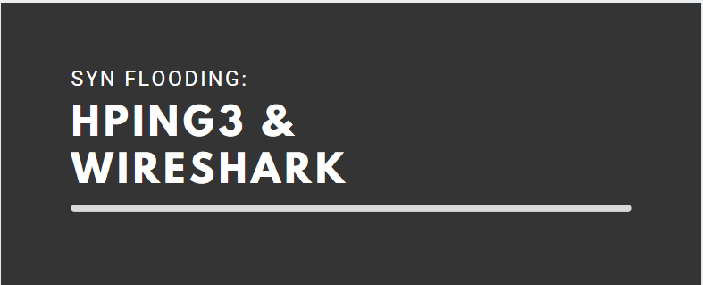

# SYN Flooding con HPING3



## ¿Que es el SYN Flooding o Inundación SYN?

La idea detrás del ataque de inundación SYN es saturar a nuestro objetivo con el envío de paquetes que tengan solo la flag SYN habilitada, sin importarnos la respuesta del servidor. Conociendo el mecanismo de negociación de 3 fases del protocolo TCP sabemos que normalmente una solicitud **`SYN`**, es respondida por el servidor con **`SYN-ACK`** para luego el cliente finalmente responder con **`ACK`** y establecer la conexión. 


En el caso del ataque SYN, dejamos al servidor a la espera de la respuesta ACK por ende la conexión permanece abierta esperando esa respuesta de una IP de origen que al estar spoofeada no enviará respuesta alguna. 


Esto produce, luego de incontables paquetes SYN recibidos, una saturación en el servidor lo cual lo imposibilita de recibir tráfico legitimo para acceder a alguno de los servicios que ofrezca. Como por ejemplo una **`pagina o aplicación web`** siendo servida en el **`puerto 80`**, dejará de responder cuando el servidor se vea saturado. En algunos casos la totalidad del servidor puede verse afectada al consumir todos los recursos disponibles y puede causar la caída del servidor o su reinicio.

Para esta práctica voy a utilizar las siguientes VMs en VMWare WorkStation:

* **VM de Ataque:** 
  * Kali 2020.4 con HPING y Wireshark instalados. 
* **VM Objetivo:** 
  * Windows 10 VM \(Parte del [lab de AD](../scanning/running-scans-with-nmap.md) local\).

## Realizando un ataque SYN Flooding con HPING

Para comenzar necesitaremos tener instalado HPING3, en distribuciones como KALI y Parrot OS ya viene instalado \(en caso contrario basta con usar el comando **`sudo apt-get install hping`**\). Una vez tenemos HPING instalado podemos comenzar a ver como realizar este ataque. Para lo cual usaremos el siguiente comando con HPING:

```text
sudo hping3 -S 192.168.1.40 -a 10.10.10.10 --flood
```

Veamos que significa cada switch que le suministramos a HPING:

| Switch | Función |
| :--- | :--- |
| **-S** | Setea la flag SYN en el paquete enviado. |
| **-a** | Para hacer IP Spoofing, es decir simular que los paquetes se envían desde otra IP y no la de nuestra maquina de ataque. Debemos especificar la IP que deseamos usar. |
| **-flood** | Le indica a HPING que envíe los paquetes lo más rápido posible sin esperar ningún tipo de respuesta del objetivo. |

Alternativamente podemos indicarle a HPING que utilice direcciones de IP aleatorias para el ataque, de esta manera cada paquete será enviado desde una IP distinta a la anterior. Para esto hacemos uso del switch **`--rand-source`**. A diferencia del switch **`-a`**, no hace falta indicar las IPs en este caso.


En un escenario real, este tráfico constante sería detectado por un Firewall o IDS \(Intrusion Detection System\) lo cual normalmente resulta en nuestra IP de origen siendo bloqueada luego de unos pocos intentos de conexión. En estos casos el uso del switch --rand-source nos permitirá evadir estas protecciones dado que cada paquete contendrá una IP de origen spoofeada y diferente a la anterior.


Veamos como se ve nuestro comando de ataque desde la terminal:


Como vemos el comando no muestra mayor información y como esperábamos tampoco procesa ninguna respuesta del objetivo ni nos avisa si los paquetes enviados en efecto arribaron al objetivo. Si vemos como reacciona la maquina objetivo podemos ver que tenemos el uso de red bastante a tope:


Cabe destacar que este ataque es "genérico", pero **`HPING`** nos da la posibilidad de especificar cuales puertos queremos atacar haciendo uso del switch **`-p num_puerto`**. Esto es especialmente útil por ejemplo si estamos atacando un puerto que sirve una aplicación web por ejemplo. En ese caso este ataque causaría que la aplicación web deje de responder normalmente dado el constante ataque con paquetes SYN que estamos realizando. Lo que en efecto sería un ataque de **Denegación de Servicio \(DoS\)**.

Veamos ahora como podemos observar este ataque y su tráfico de red usando **`Wireshark`**.

## Analizando SYN Flooding con Wireshark

Si abrimos [Wireshark](../sniffing/wireshark.md) en nuestra maquina de ataque, iniciamos la captura del trafico en el adaptador **`eth0`** y usamos el siguiente display filter **`ip.addr == 192.168.1.40 && tcp`** podemos ver los paquetes de red con la flag **`SYN`** siendo enviados al objetivo:



**NOTA:** Si dejamos que **Wireshark** capture este tráfico de red sin detener la captura luego de unos minutos, _**muy probablemente veremos que Wireshark dejará de responder**_. Algunas veces incluso _**toda la VM dejará de responder**_. 


Si analizamos el contenido de cualquiera de esos paquetes, vemos que la flag **`SYN`** que indicamos desde HPING se esta enviando correctamente:


Si detenemos el ataque en HPING podemos observar la cantidad enorme de paquetes enviados a nuestro objetivo:


De esta manera vemos que sencillo resulta realizar un simple ataque de **`DoS`** usando **`HPING`** con paquetes **`SYN`** y la funcionalidad de flooding de **`HPING`** y como podemos observar y analizar este tráfico de red usando **`Wireshark`**.


Estas prácticas están sujetas a modificaciones y correcciones, la versión más actualizada disponible se encuentra online en [el siguiente link](https://tzero86.gitbook.io/tzero86/).


