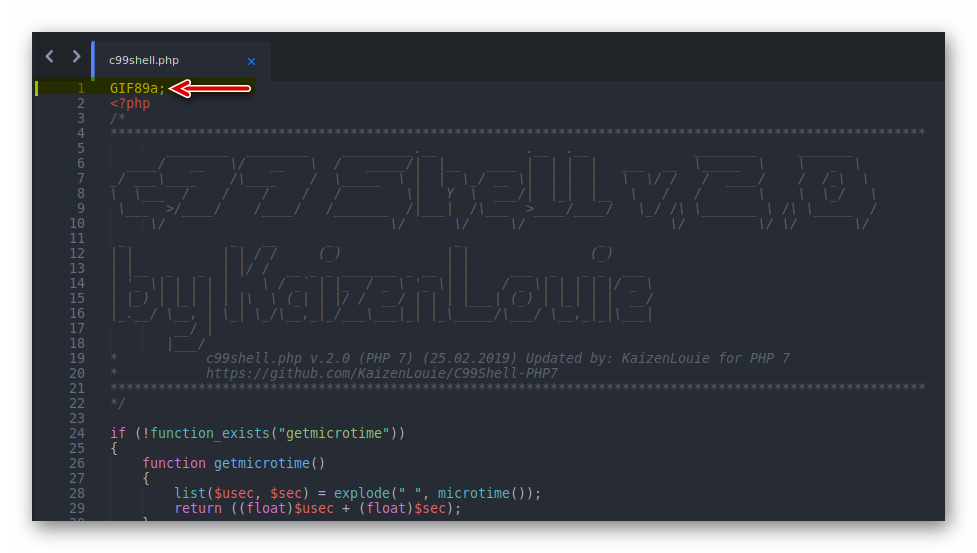

# Running scans with Nmap


## Intro: Distintos tipos de scans con Nmap

En esta práctica veremos como usar nmap para realizar distintos tipos de escaneos mediante los cuales obtendremos distintos detalles de nuestro objetivo. Para esta práctica voy a usar un laboratorio local que tengo creado para practicas de Active Directory como objetivo. Este lab corre en VMware localmente y consta de los siguientes equipos:


<table>
  <thead>
    <tr>
      <th style="text-align:left">Tipo</th>
      <th style="text-align:left">IP</th>
    </tr>
  </thead>
  <tbody>
    <tr>
      <td style="text-align:left">
        <p></p>
        <p>DC: Controlador de Dominio</p>
      </td>
      <td style="text-align:left">
        <p></p>
        <p>192.168.31.131</p>
      </td>
    </tr>
    <tr>
      <td style="text-align:left">Client1: Win 10 Enterprise</td>
      <td style="text-align:left">192.168.31.132</td>
    </tr>
    <tr>
      <td style="text-align:left">Client2: Windows 10 Pro</td>
      <td style="text-align:left">192.168.31.133</td>
    </tr>
  </tbody>
</table>

Este lab esta destinado a practicar ciertas vulnerabilidades de varios tipos, algunos de ellos detallados a continuación:

<table>
  <thead>
    <tr>
      <th style="text-align:left"></th>
      <th style="text-align:left"></th>
    </tr>
  </thead>
  <tbody>
    <tr>
      <td style="text-align:left">
        <p></p>
        <ul>
          <li>LLMNR and NBT-NS Poisoning</li>
          <li>SMB Relay Attacks</li>
          <li>Kerberoasting</li>
          <li>BloodHound and other enumeration tools</li>
        </ul>
      </td>
      <td style="text-align:left">
        <ul>
          <li>Golden Ticket</li>
          <li>Token Impersonation</li>
          <li>IPv6 DNS Takeover Attacks</li>
          <li>Credentials Dumping with Mimikatz</li>
        </ul>
      </td>
    </tr>
  </tbody>
</table>


Esta práctica no cubre las vulnerabilidades mencionadas ni la creación del lab, únicamente lo usaremos como objetivo para aprender los distintos tipos de escaneos.


Teniendo esto en cuenta debería servirnos para obtener información mediante los distintos tipos de scan usando Nmap que veremos en esta práctica.


Nmap es una herramienta que consta de muchas formas de uso, no es el objetivo de esta práctica cubrir todas. Simplemente veremos algunos tipos de escaneos a modo de ejemplo, principalmente los que uso comúnmente para resolver `labs` como los de [**VulnHub**](https://www.vulnhub.com/) y [**TryHackMe**](https://tryhackme.com/) entre otros.


## Parte 1: Escaneos Básicos.

En esta primer parte del práctico veremos los escaneos más simples que podemos realizar con nmap.

### Haciendo ping con Nmap.

Lo primero que podemos probar es como hacer ping a nuestro objetivo. Por el momento comencemos por un solo IP objetivo, el del controlador de dominio.

Para hacer un simple scan de un host con nmap podemos hacer uso del siguiente switch `-sn`, el mismo nos devuelve varios detalles del objetivo aparte de informarnos si el host esta activo, como ser la latencia y la dirección MAC del host. 


**-sn**: Ping Scan - disable port scan


El comando completo queda de la siguiente manera: 


**nmap -sn 192.168.31.131**




El uso de `sudo` no es necesario para este scan.




Con este simple scan obtuvimos la siguiente información de nuestro objetivo:

| **Info Obtenida** | Valor |
| :--- | :--- |
| Estado del Host \(Activo/Inactivo\) | Host is up |
| MAC Address  | 00:0C:29:1C:F8:3D \(VMware\) |
| Latencia | 0.00039s |

### Detectando el Sistema Operativo.

Para detectar el sistema operativo del objetivo podemos usar el siguiente switch de nmap: `-O`. Lo que nos devuelve el siguiente output en la consola:

El comando completo nos queda de esta forma:


sudo nmap -O 192.168.31.131



Este switch requiere ser ejecutado con privilegios.



Como vemos este scan no solo intenta detectar el SO \(OS fingerprinting\), sino que también ejecuta algunos análisis adicionales como ser detección de puertos comunes y detección de servicios corriendo en cada puerto.

En este caso vemos que no fue posible detectar el SO correctamente, posiblemente por alguno de los ajustes que tengo realizados en el laboratorio local. Es importante saber que disponemos de un switch alternativo para intentar detectar el SO más agresivamente: `--osscan-guess` .

Veamos como es el output cuando logra detectarlo correctamente:


 También vemos que incluye los datos que vimos en el scan anterior.

<table>
  <thead>
    <tr>
      <th style="text-align:left">Info Obtenida</th>
      <th style="text-align:left">Valor</th>
    </tr>
  </thead>
  <tbody>
    <tr>
      <td style="text-align:left">Listado de puertos abiertos y sus servicios</td>
      <td style="text-align:left">
        <p>PORT STATE SERVICE</p>
        <p>53/tcp open domain</p>
        <p>88/tcp open kerberos-sec</p>
        <p>135/tcp open msrpc</p>
        <p>139/tcp open netbios-ssn</p>
        <p>389/tcp open ldap</p>
        <p>445/tcp open microsoft-ds</p>
        <p>464/tcp open kpasswd5</p>
        <p>593/tcp open http-rpc-epmap</p>
        <p>636/tcp open ldapssl</p>
        <p>3268/tcp open globalcatLDAP</p>
        <p>3269/tcp open globalcatLDAPssl</p>
      </td>
    </tr>
    <tr>
      <td style="text-align:left">Distancia de red hasta el host</td>
      <td style="text-align:left">1 hop</td>
    </tr>
    <tr>
      <td style="text-align:left">Posible Versi&#xF3;n del Sistema Operativo (Host de ejemplo)</td>
      <td style="text-align:left">Windows XP SP3 o Windows Server 2012</td>
    </tr>
  </tbody>
</table>


### Escaneando puertos específicos.

Para escanear determinados puertos podemos hacer uso del switch `-p` el cual nos permite especificar una serie de puertos específicos, sobre los cuales realizar un scan.

El comando queda de esta manera: 


nmap -p 53,88,389,445 192.168.31.134



De esta manera podemos escanear los puertos deseados.  

Si queremos escanear por un rango de puertos en particular podemos hacerlo de la siguiente forma:


nmap -p 54-445 192.168.31.131



### Escaneando todos los puertos \(65535\).

Si en cambio queremos escanear todos los puertos podemos hacerlo de la siguiente manera, usando el switch `-p-`.

El comando queda de esta forma:


nmap -p-  192.168.31.131



Para este host en particular use el switch `-Pn` que nos permite indicarle a nmap que no realice pings. Necesario para objetivos que no responden a ping \(ICMP\) echo requests.



### Escaneo de Versiones.

Para realizar un escaneo que nos ayude a identificar las versiones de los servicios que están corriendo en el objetivo podemos hacer uso del siguiente switch `-sV`. 

El comando queda de esta forma:


nmap -sV 192.168.31.131



### TCP/IP Full Open Scan

Si queremos realizar un escaneo completamente abierto, podemos hacer uso del switch `-sT`. En este tipo de escaneo generalmente nos asegura una respuesta dado que la sesión se inicia en su totalidad \(SYN, SYN+ACK, ACK, RST\).


Importante: Este escaneo es fácilmente detectado por firewalls y otras medidas de seguridad.


Para realizar este scan el comando queda de la siguiente manera:


nmap -sT 192.168.31.131



### Stealth Scan \(Half-open\)

En muchos casos necesitamos realizar escaneos sin alertar o disparar detecciones del lado del objetivo. Para estos casos nmap cuenta con el switch `-sS`. En este tipo de scan la sesión no se completa correctamente, y únicamente los paquetes **`SYC, SYNC+ACK y RST`** son utilizados. Cuando el objetivo responde, el cliente en vez de responder con **`ACK`** responde directamente con **`RST`**.


**Este comando requiere de privilegios para correr \(sudo\).**


Para ejecutar este tipo de scan el comando queda de la siguiente forma:


nmap -sS 192.168.31.131




Como explique antes el switch adicional **`-Pn`** es necesario para hosts que no responden a ping requests \(ICMP Echo Requests\) como es el caso de este objetivo que estoy usando.


### Escanear equipos en la red

Si queremos obtener un panorama general de los equipos que están activos en la red que estamos escaneando podemos hacer uso del switch `-sP`. El mismo puede llevar un tiempo terminar dependiendo que tan extensa sea nuestra red. En Este caso el lab objetivo es bastante pequeño.

Podemos usar el comando de esta manera:


nmap -sP 192.168.31.\*


Notemos que en este caso estamos pasando parte del IP, e indicamos el último valor como `*` para que nmap automáticamente escanee todos los equipos que formen parte del mismo subnet.


Alternativamente podemos hacer uso de los switches ``**`-PS (SYN Ping) o -PR (ARP Scan)`** los cuales nos regresan resultados como estos:


De momento no explicaremos el uso de los switches/flags adicionales que puedes ver en la imagen anterior. Cubriremos esos más adelante en esta práctica.

### Escaneo con Default scripts

Nmap incorpora scripts \(NSE\) que nos permiten indicar si durante el escaneo queremos que nmap también intente correr los scripts con los que viene incorporados. Estos scripts prueban vulnerabilidades comunes que pueden aportar buena información sobre el objetivo y sobre como lograr explotarlos para obtener acceso. Esto se realiza mediante el switch `-sC`.

El comando para este tipo de scan es el siguiente:


**nmap -sC 192.168.31.131**



Vemos que los resultados que obtenemos incluyen mucha información sobre el controlador de dominio \(en este caso\) escaneado. Estos resultados varían dependiendo de que objetivo estemos escaneando y cuales sean las vulnerabilidades que nmap pueda detectar para cada caso en particular.

## Parte 2: Escaneos múltiples.

En esta parte del práctico veremos algunos escaneos más avanzados y comenzaremos a usar varios switches o flags al mismo tiempo en nuestros comandos.

Digamos que quiero obtener rápidamente toda la información que vimos, en los escaneos individuales, para tener un panorama general del objetivo lo más pronto posible. Normalmente cuando ejecuto un scan con nmap para algún laboratorio comienzo teniendo en cuenta lo siguiente:

* Tipos de datos que necesito obtener
* Tipos de datos que me gustaría obtener
* Que tan rápido quiero obtener los resultados

Usualmente en los labs de práctica o challenges del tipo Capture The Flag \(Captura la bandera\), utilizo el siguiente set de switches o flags de nmap:


sudo nmap -sC -sV -Pn -p- -T5 -O -v -oN results  192.168.31.131


Como podemos ver en esa línea anterior, hay varios switches o flags nuevos que estamos pasando a nmap que no hemos visto en esta práctica aún. Veamos uno a uno que función cumplen.

| Switch/Flag | Función |
| :---: | :--- |
| **-T5** |  Indica la velocidad del scan. Valores posibles 1 a 5, siendo 5 el más alto. \(Aumenta la detención de nuestro scan por parte de los mecanismos de defensa que tenga el objetivo\) |
| **-v** | Indica a nmap que debe producir output verboso, proveyendo al usuario con mucho detalle sobre cada scan y su resultado. |
| **-oN &lt;archivoSalida&gt;** | Indica a nmap que debe generar un archivo de salida con los resultados. En este caso en formato común \(texto\). |

Este tipo de escaneo suele resultar en un output extenso en la consola, por eso es buena idea guardarlo directamente a un archivo para consultarlo cuando sea necesario.


El resultado de este scan en su totalidad de puede ver en el siguiente bloque, dado que no amerita capturarlo en imágenes en su totalidad:

```text
┌──(kali㉿kali)-[~]
└─$ sudo nmap -sC -sV -Pn -p- -T5 -O -v -oN results  192.168.31.131
[sudo] password for kali: 
Host discovery disabled (-Pn). All addresses will be marked 'up' and scan times will be slower.
Starting Nmap 7.91 ( https://nmap.org ) at 2020-12-06 13:48 EST
NSE: Loaded 153 scripts for scanning.
NSE: Script Pre-scanning.
Initiating NSE at 13:48
Completed NSE at 13:48, 0.00s elapsed
Initiating NSE at 13:48
Completed NSE at 13:48, 0.00s elapsed
Initiating NSE at 13:48
Completed NSE at 13:48, 0.00s elapsed
Initiating ARP Ping Scan at 13:48
Scanning 192.168.31.131 [1 port]
Completed ARP Ping Scan at 13:48, 0.05s elapsed (1 total hosts)
Initiating Parallel DNS resolution of 1 host. at 13:48
Completed Parallel DNS resolution of 1 host. at 13:48, 0.01s elapsed
Initiating SYN Stealth Scan at 13:48
Scanning 192.168.31.131 [65535 ports]
Discovered open port 53/tcp on 192.168.31.131
Discovered open port 135/tcp on 192.168.31.131
Discovered open port 139/tcp on 192.168.31.131
Discovered open port 445/tcp on 192.168.31.131
Discovered open port 49703/tcp on 192.168.31.131
Discovered open port 9389/tcp on 192.168.31.131
Discovered open port 49667/tcp on 192.168.31.131
Discovered open port 3268/tcp on 192.168.31.131
Discovered open port 636/tcp on 192.168.31.131
Discovered open port 49674/tcp on 192.168.31.131
Discovered open port 49676/tcp on 192.168.31.131
Discovered open port 3269/tcp on 192.168.31.131
Discovered open port 49666/tcp on 192.168.31.131
SYN Stealth Scan Timing: About 45.08% done; ETC: 13:49 (0:00:38 remaining)
Discovered open port 593/tcp on 192.168.31.131
Discovered open port 5985/tcp on 192.168.31.131
Discovered open port 49673/tcp on 192.168.31.131
Discovered open port 88/tcp on 192.168.31.131
Discovered open port 464/tcp on 192.168.31.131
Discovered open port 49710/tcp on 192.168.31.131
Discovered open port 49686/tcp on 192.168.31.131
Discovered open port 389/tcp on 192.168.31.131
Completed SYN Stealth Scan at 13:49, 55.14s elapsed (65535 total ports)
Initiating Service scan at 13:49
Scanning 21 services on 192.168.31.131
Completed Service scan at 13:50, 53.60s elapsed (21 services on 1 host)
Initiating OS detection (try #1) against 192.168.31.131
Retrying OS detection (try #2) against 192.168.31.131
NSE: Script scanning 192.168.31.131.
Initiating NSE at 13:50
Completed NSE at 13:51, 40.06s elapsed
Initiating NSE at 13:51
Completed NSE at 13:51, 0.07s elapsed
Initiating NSE at 13:51
Completed NSE at 13:51, 0.00s elapsed
Nmap scan report for 192.168.31.131
Host is up (0.00045s latency).
Not shown: 65514 filtered ports
PORT      STATE SERVICE       VERSION
53/tcp    open  domain        Simple DNS Plus
88/tcp    open  kerberos-sec  Microsoft Windows Kerberos (server time: 2020-12-06 18:49:48Z)
135/tcp   open  msrpc         Microsoft Windows RPC
139/tcp   open  netbios-ssn   Microsoft Windows netbios-ssn
389/tcp   open  ldap          Microsoft Windows Active Directory LDAP (Domain: CHUKARO.local0., Site: Default-First-Site-Name)
| ssl-cert: Subject: commonName=Chukaro-DC.CHUKARO.local
| Subject Alternative Name: othername:<unsupported>, DNS:Chukaro-DC.CHUKARO.local
| Issuer: commonName=CHUKARO-CHUKARO-DC-CA
| Public Key type: rsa
| Public Key bits: 2048
| Signature Algorithm: sha256WithRSAEncryption
| Not valid before: 2020-11-24T20:30:01
| Not valid after:  2021-11-24T20:30:01
| MD5:   b134 42d1 5e7e 2394 dc8a 0eae 3e6f bb9f
|_SHA-1: 0fb3 428c 8b1f 8a6b b92a 785a a84e cc3f c393 74dd
|_ssl-date: 2020-12-06T18:51:20+00:00; 0s from scanner time.
445/tcp   open  microsoft-ds?
464/tcp   open  kpasswd5?
593/tcp   open  ncacn_http    Microsoft Windows RPC over HTTP 1.0
636/tcp   open  ssl/ldap      Microsoft Windows Active Directory LDAP (Domain: CHUKARO.local0., Site: Default-First-Site-Name)
| ssl-cert: Subject: commonName=Chukaro-DC.CHUKARO.local
| Subject Alternative Name: othername:<unsupported>, DNS:Chukaro-DC.CHUKARO.local
| Issuer: commonName=CHUKARO-CHUKARO-DC-CA
| Public Key type: rsa
| Public Key bits: 2048
| Signature Algorithm: sha256WithRSAEncryption
| Not valid before: 2020-11-24T20:30:01
| Not valid after:  2021-11-24T20:30:01
| MD5:   b134 42d1 5e7e 2394 dc8a 0eae 3e6f bb9f
|_SHA-1: 0fb3 428c 8b1f 8a6b b92a 785a a84e cc3f c393 74dd
|_ssl-date: 2020-12-06T18:51:20+00:00; 0s from scanner time.
3268/tcp  open  ldap          Microsoft Windows Active Directory LDAP (Domain: CHUKARO.local0., Site: Default-First-Site-Name)
| ssl-cert: Subject: commonName=Chukaro-DC.CHUKARO.local
| Subject Alternative Name: othername:<unsupported>, DNS:Chukaro-DC.CHUKARO.local
| Issuer: commonName=CHUKARO-CHUKARO-DC-CA
| Public Key type: rsa
| Public Key bits: 2048
| Signature Algorithm: sha256WithRSAEncryption
| Not valid before: 2020-11-24T20:30:01
| Not valid after:  2021-11-24T20:30:01
| MD5:   b134 42d1 5e7e 2394 dc8a 0eae 3e6f bb9f
|_SHA-1: 0fb3 428c 8b1f 8a6b b92a 785a a84e cc3f c393 74dd
|_ssl-date: 2020-12-06T18:51:20+00:00; 0s from scanner time.
3269/tcp  open  ssl/ldap      Microsoft Windows Active Directory LDAP (Domain: CHUKARO.local0., Site: Default-First-Site-Name)
| ssl-cert: Subject: commonName=Chukaro-DC.CHUKARO.local
| Subject Alternative Name: othername:<unsupported>, DNS:Chukaro-DC.CHUKARO.local
| Issuer: commonName=CHUKARO-CHUKARO-DC-CA
| Public Key type: rsa
| Public Key bits: 2048
| Signature Algorithm: sha256WithRSAEncryption
| Not valid before: 2020-11-24T20:30:01
| Not valid after:  2021-11-24T20:30:01
| MD5:   b134 42d1 5e7e 2394 dc8a 0eae 3e6f bb9f
|_SHA-1: 0fb3 428c 8b1f 8a6b b92a 785a a84e cc3f c393 74dd
|_ssl-date: 2020-12-06T18:51:20+00:00; 0s from scanner time.
5985/tcp  open  http          Microsoft HTTPAPI httpd 2.0 (SSDP/UPnP)
|_http-server-header: Microsoft-HTTPAPI/2.0
|_http-title: Not Found
9389/tcp  open  mc-nmf        .NET Message Framing
49666/tcp open  msrpc         Microsoft Windows RPC
49667/tcp open  msrpc         Microsoft Windows RPC
49673/tcp open  ncacn_http    Microsoft Windows RPC over HTTP 1.0
49674/tcp open  msrpc         Microsoft Windows RPC
49676/tcp open  msrpc         Microsoft Windows RPC
49686/tcp open  msrpc         Microsoft Windows RPC
49703/tcp open  msrpc         Microsoft Windows RPC
49710/tcp open  msrpc         Microsoft Windows RPC
MAC Address: 00:0C:29:1C:F8:3D (VMware)
Warning: OSScan results may be unreliable because we could not find at least 1 open and 1 closed port
OS fingerprint not ideal because: Timing level 5 (Insane) used
No OS matches for host
Network Distance: 1 hop
TCP Sequence Prediction: Difficulty=263 (Good luck!)
IP ID Sequence Generation: Incremental
Service Info: Host: CHUKARO-DC; OS: Windows; CPE: cpe:/o:microsoft:windows

Host script results:
| nbstat: NetBIOS name: CHUKARO-DC, NetBIOS user: <unknown>, NetBIOS MAC: 00:0c:29:1c:f8:3d (VMware)
| Names:
|   CHUKARO-DC<20>       Flags: <unique><active>
|   CHUKARO-DC<00>       Flags: <unique><active>
|   CHUKARO<00>          Flags: <group><active>
|   CHUKARO<1c>          Flags: <group><active>
|_  CHUKARO<1b>          Flags: <unique><active>
| smb2-security-mode: 
|   2.02: 
|_    Message signing enabled and required
| smb2-time: 
|   date: 2020-12-06T18:50:40
|_  start_date: N/A

NSE: Script Post-scanning.
Initiating NSE at 13:51
Completed NSE at 13:51, 0.00s elapsed
Initiating NSE at 13:51
Completed NSE at 13:51, 0.00s elapsed
Initiating NSE at 13:51
Completed NSE at 13:51, 0.00s elapsed
Read data files from: /usr/bin/../share/nmap
OS and Service detection performed. Please report any incorrect results at https://nmap.org/submit/ .
Nmap done: 1 IP address (1 host up) scanned in 153.56 seconds
           Raw packets sent: 131159 (5.775MB) | Rcvd: 75 (3.856KB)

```

De esta forma vimos variados tipos de escaneos que podemos realizar con nmap para obtener importante información sobre nuestro objetivo. En la siguiente sección recopilaremos rápidamente todos los datos que logramos obtener a lo largo de esta práctica sobre el objetivo escaneado.

## Parte 3: Recopilando la información.

En esta parte recopilaremos y presentaremos toda la información que obtuvimos de todos los tipos de escaneos practicados.

Durante esta práctica vimos de que manera podemos utilizar un subset de funcionalidades ofrecidas por nmap para realizar distintos tipos de escaneos a nuestro objetivo con el fin de obtener una serie de detalles para nuestro  pentest.



<table>
  <thead>
    <tr>
      <th style="text-align:center">Dato</th>
      <th style="text-align:center">Detalle</th>
    </tr>
  </thead>
  <tbody>
    <tr>
      <td style="text-align:center"><b>Puertos abiertos y servicios (DC)</b>
      </td>
      <td style="text-align:center">
        <p>53 (domain Simple DNS Plus)
          <br />135 (MS Windows RPC)
          <br />139 (MS Netbios SSN)
          <br />445 (MS DS)
          <br />49703 (MS Win RPC)
          <br />9389 (.NET Message Framing)
          <br />49667 ( MS Win RPC)
          <br />3268 (MS Active Directory LDAP)</p>
        <p>3269 (MS Active Directory LDAP)
          <br />636 (SSL LDAP)
          <br />49674 (MS Win RPC)
          <br />49666 (MS Win RPC)
          <br />593 (MS Win RPC Over HTTP 1.0)
          <br />5985 (Microsoft HTTPAPI httpd 2.0 (SSDP/UPnP))</p>
        <p>49673 (Microsoft Win RPC over HTTP 1.0)</p>
        <p>88 (MS Kerberos)</p>
        <p>464 (kpasswd5)</p>
        <p>49710 (MS Win RPC)</p>
        <p>49686 (MS Win RPC)</p>
        <p>389 (MS Active Directory LDAP).</p>
      </td>
    </tr>
    <tr>
      <td style="text-align:center"><b>Domain Controller Domain Name</b>
      </td>
      <td style="text-align:center">Chukaro-DC.CHUKARO.local</td>
    </tr>
    <tr>
      <td style="text-align:center"><b>Sistema Operativo</b>
      </td>
      <td style="text-align:center">MS Windows</td>
    </tr>
    <tr>
      <td style="text-align:center"><b>Equipos activos en la subnet del DC</b>
      </td>
      <td style="text-align:center">
        <p>192.168.31.1</p>
        <p>192.168.31.2</p>
        <p>192.168.31.131 (DC)
          <br />192.168.31.31.132 (Client1)
          <br />192.168.31.31.133 (Client2)</p>
        <p>192.168.31.31.134</p>
      </td>
    </tr>
  </tbody>
</table>



Hasta acá llegamos con esta práctica de scanning con nmap, vimos como ejecutar distintos tipos de scan para obtener variadas piezas de información y aprendimos el usó básico de nmap.


Estas prácticas están sujetas a modificaciones y correcciones, la versión más actualizada disponible se encuentra online en [el siguiente link](https://tzero86.gitbook.io/tzero86/).


