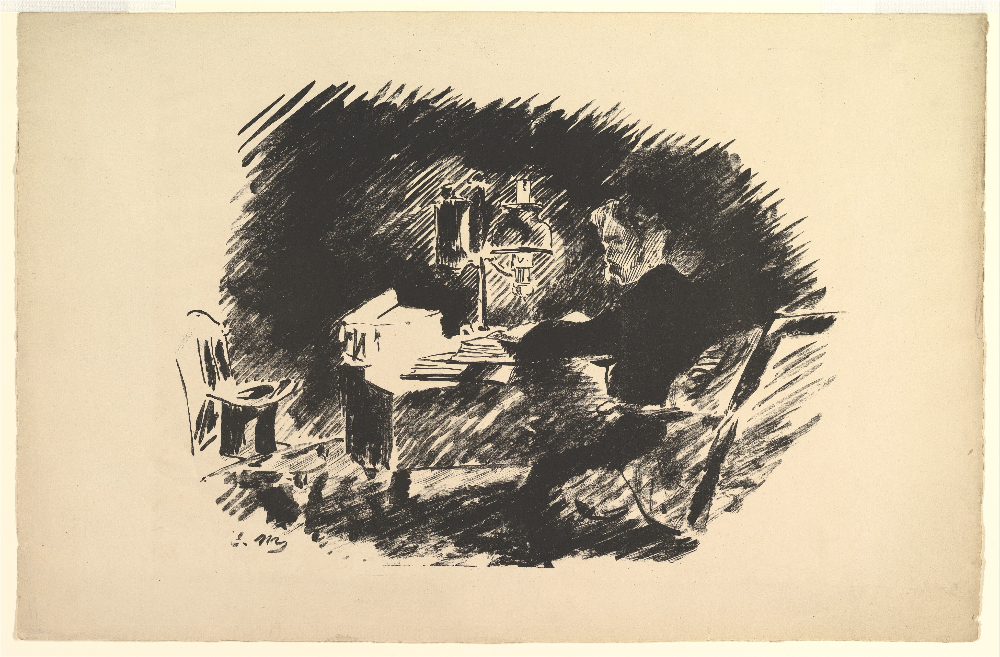

# Esteganografía (Steganography)

## Esteganografía

.png>)

En esta mini práctica veremos como podemos ocultar información dentro de otros archivos y veremos como es el proceso de extracción de esta información oculta.  Con el uso de esteganografía, podemos ocultar información dentro de otro archivo que luego pueda ser distribuido sin importar que sea visto por terceros. Su contenido oculto es visible únicamente a quienes estén al tanto de que existe y sepan como extraerlo. Generalmente este contenido oculto es también encriptado de manera que se requiera una palabra clave para poder extraerlo.


**Wikipedia:** La **esteganografía** (del [griego](https://es.wikipedia.org/wiki/Griego_antiguo) στεγανος steganos, "cubierto" u "oculto", y γραφος graphos, "escritura") trata el estudio y aplicación de técnicas que permiten ocultar mensajes u objetos, dentro de otros, llamados portadores, de modo que no se perciba su existencia. Es decir, procura ocultar mensajes dentro de otros objetos y de esta forma establecer un [canal encubierto](https://es.wikipedia.org/wiki/Canal_encubierto) de comunicación, de modo que el propio acto de la comunicación pase inadvertido para observadores que tienen acceso a ese canal.

&#x20;**Leer más en el siguiente** :point\_right: [**link**](https://es.wikipedia.org/wiki/Esteganograf%C3%ADa).


Existen diversas herramientas que nos permiten ver este proceso en acción, en esta práctica en particular usaremos Steghide.&#x20;

## Esteganografía básica con **`Steghide`**

La ilustración de arriba puede parecer una imagen común, sin embargo **`contiene oculto en su interior el poema completo`** llamado **`El Cuervo`** de **`Edgar Allan Poe`**. A simple vista la imagen no presenta indicios de ser algo más de lo que se puede apreciar, y con eso podemos darnos una idea del potencial de la esteganografía para ocultar información y trasladarla incluso ante la vista de terceros sin que el mensaje oculto pueda ser detectado a simple vista.

### Ocultando información con **`Steghide`**

Veamos los comandos básicos de **`steghide`** que debemos usar para lograr replicar ese resultado y llevar a cabo nuestra práctica básica en esteganografía.  Lo primero que debemos hacer es contar con los archivos básicos:

* [x] Una Imagen.
* [x] El Mensaje que deseamos ocultar.
* [x] Steghide.

el uso básico de steghide es súper sencillo, basta con hacer uso de las siguientes opciones:


**steghide embed -cf {cover\_file} -ef {embed\_image}**


* **`embed`**: le indica a steghide el modo que queremos usar. En este caso embed inserta contenido dentro del archivo destino.
* **`-cf FILE`**: Indica a steghide el archivo que funcionara como cover, en este caso la imagen que contendrá la información oculta. Para nuestro ejemplo este archivo es **`RAVEN.jpg`**.
* **`-ef FILE`**: Indica la ruta al archivo que se ocultará en el archivo cover. Para nuestro ejemplo este archivo es **`MESSAGE`** que contiene el poema completo **`El Cuervo`**.
* **`passphrase`**: la clave necesaria para extraer el contenido oculto. Para este ejemplo la clave es **`POE`**.

.png>)

Como podemos ver el tamaño del archivo **`RAVEN.jpg`** sufre un cambio de peso luego del proceso. Es importante tener esto presente dado que si el mensaje que intentamos ocultar es demasiado grande, debemos recurrir a una imagen más grande que contenga la suficiente capacidad para poder almacenar nuestro mensaje. Esto ocurre así por la forma en la que la esteganografía hace uso de los bits menos significativos de la imagen para reemplazarlos por los bits que conforman nuestro mensaje oculto.

Podemos ver esto ejemplificado en la siguiente imagen donde los bits menos significativos de la imagen son alterados para almacenar los bits que conforman la palabra cat.

.png>)

### Viendo **`Información embebida`** con **`Steghide`**

Veamos ahora de que manera podemos usar steghide para ver si nuestra imagen contiene información oculta embebida. Para esto hacemos uso de las siguientes opciones:


**steghide info {Archivo\_Cover}**


* **`info FILE`**: el modo de operación que le indica a steghide que deseamos ver información del archivo. Entre los resultados devueltos se puede obtener: **`Algoritmo`** de encriptado usado, **`tamaño`** de archivo, **`nombre`** del archivo embebido y **`formato`** del archivo cover usado.

.png>)

Como podemos ver para realizar esta operación necesitamos de la passphrase (clave) que haya sido utilizada al momento de ocultar la información. En este caso conocemos la **`clave`**, en muchos casos esta información es desconocida y deberemos recurrir a la **`ingeniería social`**, o al **`brute-forcing`** con herramientas como **`stegcrack`** para obtener la clave y poder usar este comando. Lo mismo aplica también para el proceso de extraer la información embebida.

### Extrayendo **`información embebida`** con **`Steghide`**

Llegado el momento necesitaremos extraer la información oculta de la imagen, para esto usaremos las siguientes opciones de **`steghide`**:


**steghide extract -sf {ARCHIVO\_COVER}**


* **`extract`**: Indica a steghide que queremos realizar la extracción de data embebida de un archivo cover.
* **`-sf FILE`**: Le indica a steghide la imagen cover desde donde queremos extraer la información embebida.
* **`passphrase`**: La clave para poder extraer el contenido oculto.

.png>)

Si revisamos el contenido del archivo extraído, podemos ver que en efecto contiene el poema que habíamos ocultado antes:

.png>)

De esta forma vimos como podemos hacer uso de la esteganografía para ocultar información dentro de otros archivos, que en apariencia se presentan normales para cualquiera que los vea.

Cabe aclarar que la esteganografía no se limita a archivos de imagen y texto y también se puede por ejemplo embeber Código fuente dentro audio y video con el uso de otras herramientas. En el caso de Steghide en particular nos permite ocultar información dentro de archivos con los siguientes formatos: **`WAV`**, **`JPEG`**, **`AU`** y **`BMP`**.

Steghide cuenta con numerosas opciones para refinar a gusto como se lleva a cabo el proceso de embeber contenido dentro de otros archivos. No esta dentro del alcance de esta práctica ver todo el funcionamiento de steghide y es importante tener en claro que existen distintas herramientas alternativas con las que podemos obtener el mismo resultado.


Estas prácticas están sujetas a modificaciones y correcciones, la versión más actualizada disponible se encuentra online en [el siguiente link](https://tzero86.gitbook.io/tzero86/).


